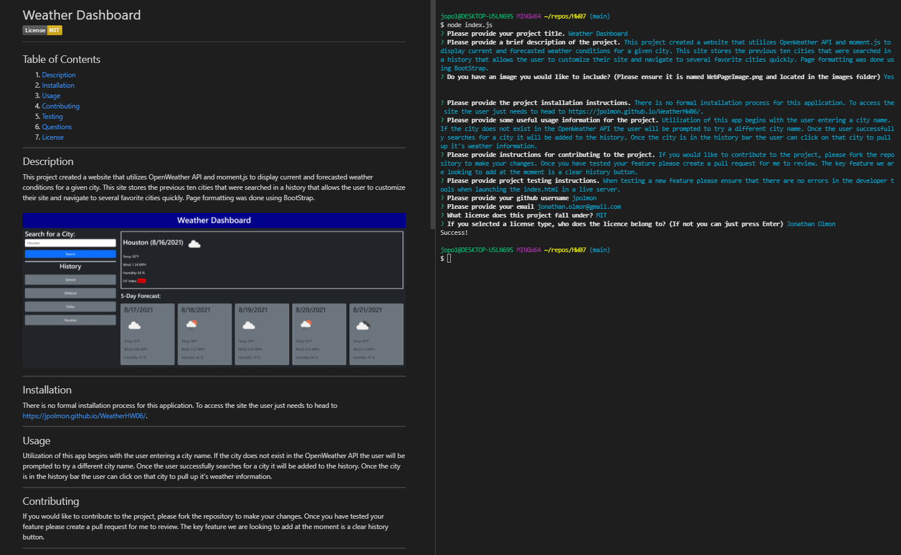

# Server-Side APIs: Weather Dashboard

## Purpose

The purpose of this project was to create README generator that would ask the user several questions about a project and then generate a README.md file for them. 

Some features of the site are:
- This application is fully customizable in the sense that the README will only contain the sections that the user fills out. 
- The questions section of the README will display different messages based on the amount of contact information they wish to provide.  
- The user can opt to include an image for the README and the program will check to make sure it is saved correctly before attempting to display it. 

---

## Utilization

This application is intended to be used with at least the Title and Description having inputs. any other information is to be put in at the users discretion. 

Please make sure that the image you wish to utilize is saved relative to the main repo as './assets/images/WebPageImage.png'. If this is not followed the image will not display.

A guide to utilizing the application can be found at: https://www.youtube.com/watch?v=CRy-SWoR2wI

---
## Appearance

### Here is an example of the application with the generated README:  

