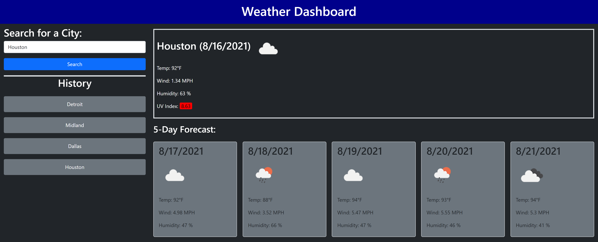

# Weather Dashboard  

  
## Table of Contents
1. [Description](#desc) 
2. [Installation](#install)
3. [Usage](#usage)
4. [Contributing](#contrib)
5. [Testing](#testing)
6. [Questions](#ques)
7. [License](#license)

---

 
## Description 
This project created a website that utilizes OpenWeather API and moment.js to display current and forecasted weather conditions for a given city. This site stores the previous ten cities that were searched in a history that allows the user to customize their site and navigate to several favorite cities quickly. Page formatting was done using BootStrap. 
   

---

 
## Installation 
There is no formal installation process for this application. To access the site the user just needs to head to https://jpolmon.github.io/WeatherHW06/.

---

 
## Usage 
Utilization of this app begins with the user entering a city name. If the city does not exist in the OpenWeather API the user will be prompted to try a different city name. Once the user successfully searches for a city it will be added to the history. Once the city is in the history bar the user can click on that city to pull up it's weather information. 

---

 
## Contributing 
If you would like to contribute to the project, please fork the repository to make your changes. Once you have tested your feature please create a pull request for me to review. The key feature we are looking to add at the moment is a clear history button.

---

 
## Testing 

---

 
## Questions 
If you have any questions please reach out to me at github.com/jpolmon or via email at jonathan.olmon@gmail.com.

---

## License

